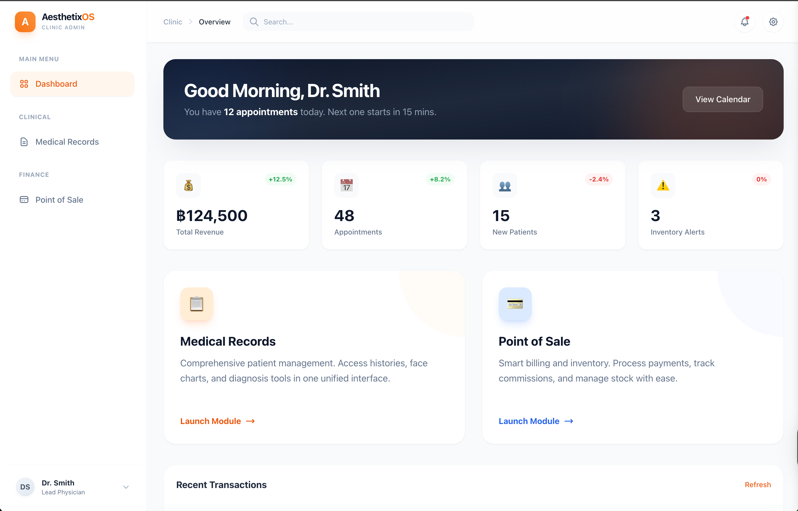
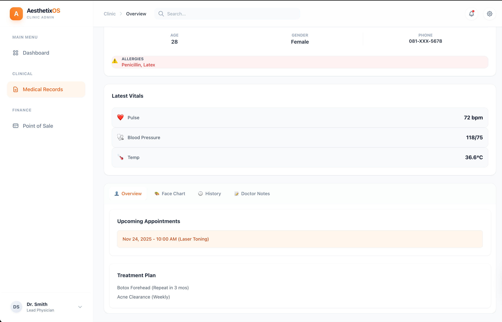
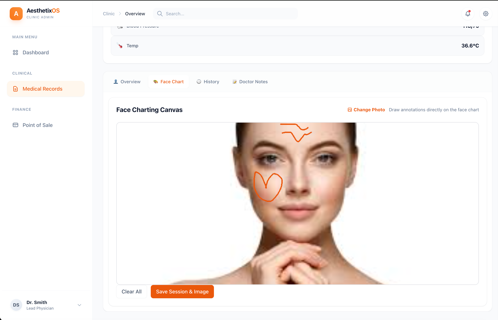
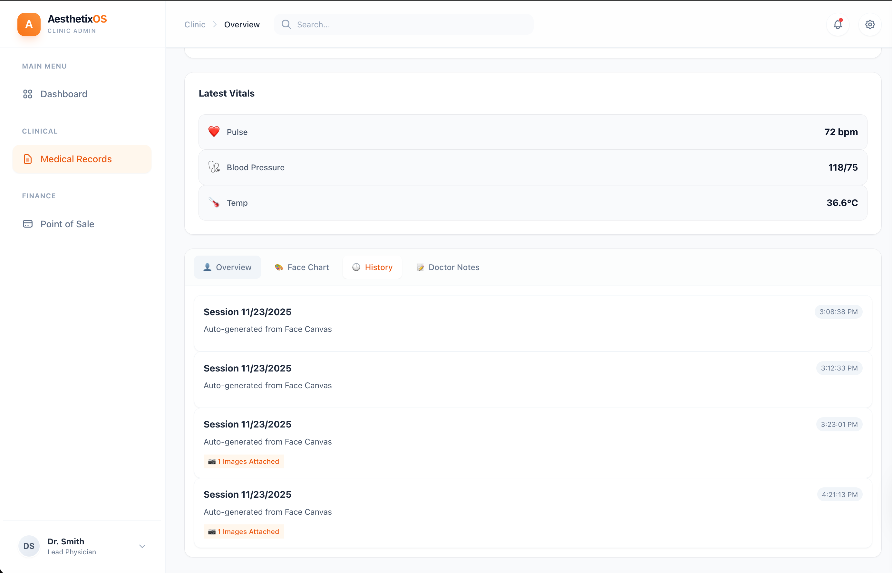
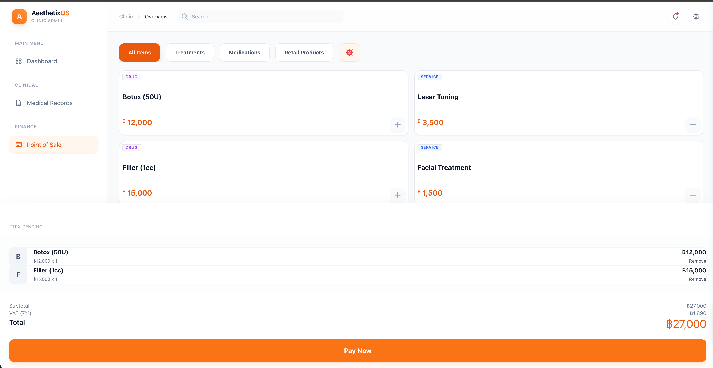
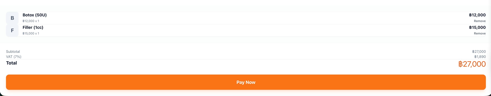

# Product Preview

## Dashboard Page



The **Dashboard** serves as the central command center for clinic administrators and physicians. It provides at-a-glance insights into daily operations and key performance metrics:

- **Personalized Greeting**: Welcomes the user with real-time appointment information
- **Key Metrics Display**:
  - **Total Revenue** with percentage change indicators
  - **Appointments** count with growth trends
  - **New Patients** tracking with change indicators
  - **Inventory Alerts** for low-stock items requiring attention
- **Module Access**: Quick launch cards for both main modules:
  - **Medical Records**: Access patient histories, face charts, and diagnosis tools
  - **Point of Sale**: Process payments, track commissions, and manage inventory
- **Recent Transactions**: Real-time feed of the latest clinic activities
- **Navigation**: Clean sidebar with role-based menu items (Clinical vs. Finance sections)

## Medical Record Page

### Overview



The **Overview** tab consolidates critical patient information in a single, comprehensive view:

- **Patient Demographics**: Age, Gender, with **PDPA-compliant** phone masking based on user role permissions
- **Allergy Warnings**: Prominent alert banner displaying critical allergies for patient safety
- **Latest Vitals**: Real-time monitoring of patient health indicators including pulse, blood pressure, and temperature
- **Upcoming Appointments**: Scheduled treatments with dates and procedure types
- **Treatment Plan**: Ongoing therapy schedules with frequency and repeat intervals
- **Tab Navigation**: Quick access to Overview, Face Chart, History, and Doctor Notes

### Face Chart



The **Face Charting Canvas** is the flagship feature for precise treatment documentation:

- **HTML5 Canvas Drawing Tool**: Allows physicians to draw annotations directly on high-resolution patient photos
- **Annotation Features**:
  - Mark injection points for fillers and Botox
  - Outline treatment areas on the face
  - Visual documentation of treatment plans
- **Direct Upload Integration**: Uses **MinIO Presigned URLs** for zero-latency image uploads, bypassing the application server
- **Session Management**:
  - Upload new patient images
  - Reset annotations as needed
  - Persist annotations as JSON coordinates linked to the treatment session
- **Use Case**: Critical for aesthetic procedures where precise location documentation is required for before/after comparisons and treatment tracking

### History



The **History** tab provides a chronological timeline of all patient treatment sessions:

- **Session Timeline**: Auto-generated records from Face Canvas saves with date stamps
- **Timestamp Tracking**: Precise time stamps for each session
- **Image Attachments**: Visual indicators showing which sessions include face chart photos
- **Source Attribution**: Each entry notes it was auto-generated from Face Canvas
- **Audit Trail**: Complete historical record for compliance, insurance claims, and treatment outcome analysis
- **Purpose**: Enables doctors to track treatment progression over time and demonstrate patient journey

## Point of Sale Page

### Smart Course Grid



The **Smart Course Grid** is the centerpiece of the Point of Sale module, designed for rapid checkout and intuitive product selection:

- **Categorized Inventory**: Tabbed interface organizing products into Treatments, Medications, and Retail Products with quick filtering
- **Product Cards**: Clean grid layout with category badges distinguishing between drugs and services
- **Pricing Display**: All prices shown in local currency with instant add-to-cart functionality via quick-add buttons
- **Real-time Cart**: Bottom panel tracking selected items with:
  - Abbreviated item codes for space efficiency
  - Unit prices and quantity multipliers
  - Remove functionality for cart adjustments
  - Live subtotal calculation
  - Automatic VAT computation with breakdown display
  - Prominent total amount in bold typography
- **One-Click Checkout**: Large action button for seamless transaction completion
- **Transaction Context**: Active transaction identifier displayed for audit trail linkage
- **Use Case**: Optimized for high-volume cashier operations requiring speed and accuracy across multi-item sales while maintaining real-time inventory synchronization

### Checkout Summary



The **Checkout Summary** provides a streamlined final review before payment processing:

- **Itemized Breakdown**: Clean list of selected products with abbreviated codes for rapid scanning
- **Product Details**: Full specifications with individual unit prices and quantity multipliers
- **Last-Minute Adjustments**: Remove options available for each line item before finalizing
- **Financial Summary**:
  - Subtotal calculation from all line items
  - VAT breakdown with exact tax amount displayed separately
  - Bold total amount in prominent orange typography for clear visual hierarchy
- **Single Action Flow**: Large payment button positioned for easy access and quick processing
- **Minimal Interface**: Focused design eliminating navigation elements to prevent transaction interruption
- **Use Case**: Ensures transaction accuracy and provides transparent pricing breakdown for customer review before payment commitment, reducing disputes and chargebacks


# Project Specification: AesthetixOS
### Modular Clinic Resource Planning (ERP) System

**AesthetixOS** is a cloud-native ERP solution tailored for the aesthetic medicine industry. It addresses the specific challenges of high-resolution medical imaging, complex therapist commission structures, and strictly segmented workflows (Clinical vs. Commercial).

The system is architected as a **Monorepo** utilizing **Micro-Frontends** to decouple domain logic and a **Django** backend optimized for asynchronous processing and secure data handling.

---

## 1. High-Level Architecture

### Core Design Patterns
*   **Micro-Frontends (Module Federation):** The frontend is split into a "Host" (Shell) and separate "Remotes" for EMR (Electronic Medical Records) and POS (Point of Sale). This ensures independent deployability and strict separation of concerns.
*   **Direct-to-Object Storage:** High-resolution clinical photos bypass the application server, uploading directly to MinIO (S3 compatible) via Presigned URLs to reduce latency and server load.
*   **Asynchronous Computing:** Complex commission calculations are offloaded to a background task queue (Celery) to ensure the POS terminal remains non-blocking during checkout.
*   **Design System:** A shared UI library ensures visual consistency across all micro-applications.

---

## 2. Repository Structure (Monorepo)

```text
/aesthetix-os
│
├── /packages                  # Shared Frontend Logic
│   └── /ui-kit                # Internal Design System (Buttons, Inputs, Tables)
│
├── /backend-core              # Python/Django API
│   ├── /core                  # Settings, Auth, middleware
│   ├── /clinic                # App: EMR, Photos, PDPA logic
│   ├── /commerce              # App: Inventory, Courses, Ledger
│   ├── /tasks                 # Celery tasks (Commission calculation)
│   ├── manage.py
│   └── Dockerfile
│
├── /frontend-host             # Vue.js (Application Shell)
│   ├── /src                   # Auth, Navigation, Layouts
│   ├── vite.config.js         # Federation: HOST
│   └── Dockerfile
│
├── /frontend-remote-emr       # Vue.js (Medical Module)
│   ├── /src                   # Face Charting, Image Gallery
│   ├── vite.config.js         # Federation: REMOTE (exposes 'PatientModule')
│   └── Dockerfile
│
├── /frontend-remote-pos       # Vue.js (Cashier Module)
│   ├── /src                   # Course Grid, Checkout Flow
│   ├── vite.config.js         # Federation: REMOTE (exposes 'BillingModule')
│   └── Dockerfile
│
└── docker-compose.yml         # Infrastructure Orchestration
```

---

## 3. Technology Stack

| Layer | Technology | Key Libraries/Tools |
| :--- | :--- | :--- |
| **Backend** | Python 3.11 | **Django 5.0**, **DRF**, **Celery** (Async), **Boto3** (S3/MinIO), **Pytest** |
| **Database & Cache** | SQL / NoSQL | **PostgreSQL 15** (Relational), **Redis** (Broker/Cache), **MinIO** (Object Storage) |
| **Frontend (Core)** | JavaScript | **Vue.js 3** (Composition API), **Vite**, **Pinia** (State), **TypeScript** |
| **Frontend (Arch)** | Federation | **vite-plugin-federation**, **Lerna** or **npm workspaces** (Monorepo tools) |
| **UI & Style** | Styling | **TailwindCSS**, **Headless UI** (Accessible components) |
| **Infra** | Containerization | **Docker**, **Docker Compose**, **Nginx** (Reverse Proxy) |

---

## 4. Backend Specifications (Django)

The backend exposes a RESTful API (`/api/v1/`).

### Module A: Clinical Operations (`/clinic`)
**Focus:** Medical Data, PDPA Compliance, Image Handling.

1.  **Feature: Zero-Trust Image Uploads (Presigned URLs)**
    *   *Problem:* Uploading 4K "Before/After" photos crashes standard HTTP threads.
    *   *Solution:*
        *   Endpoint `GET /api/v1/clinic/upload-token/`: Returns a temporary MinIO Presigned URL.
        *   Client uploads file directly to MinIO storage.
        *   Endpoint `POST /api/v1/clinic/confirm-upload/`: Client notifies backend to link the S3 key to the `TreatmentSession` model.
2.  **Feature: Role-Based Data Masking (PDPA)**
    *   *Logic:* Custom DRF Serializer Field (`PDPAMaskingField`).
    *   *Behavior:* Checks `request.user.role`.
        *   If `Doctor`: Returns `081-555-0101`.
        *   If `Receptionist`: Returns `081-XXX-0101`.

### Module B: Commerce & Revenue (`/commerce`)
**Focus:** Financials, Inventory, Commissions.

1.  **Feature: Asynchronous Commission Engine**
    *   *Problem:* Calculating multi-tier commissions (e.g., "10% if sales > 100k, else 5%", split between 2 therapists) freezes the POS.
    *   *Solution:*
        *   Checkout triggers `tasks.calculate_commission.delay(transaction_id)`.
        *   Celery Worker processes logic in background.
        *   Updates `CommissionLog` model.
        *   Frontend polls or receives WebSocket update when calculation completes.
2.  **Feature: Event-Driven Data Signals**
    *   *Logic:* Uses Django Signals (`post_save`).
    *   *Purpose:* When `UserCourseBalance` is deducted, a signal is emitted. Ideally formatted to be structurally ready for a Message Broker (Kafka) to demonstrate readiness for Data Lake integration.

---

## 5. Frontend Specifications (Vue.js Micro-Frontends)

### Service 1: Shared UI Kit (`@aesthetix/ui-kit`)
*   **Role:** Internal npm package / submodule.
*   **Content:** Atomic components (`BaseButton`, `InputGroup`, `Modal`) styled with Tailwind.
*   **Why:** Ensures the EMR and POS modules look identical to the Host, simulating a unified Design System.

### Service 2: Host Application (`frontend-host`)
*   **Port:** 3000
*   **Responsibilities:**
    *   **Global Auth:** Login Page. Stores JWT in `localStorage`.
    *   **Event Bus:** Listens for global events (e.g., `SESSION_EXPIRED`) to trigger redirects.
    *   **Layout:** Top navigation and Sidebar.
    *   **Federation:** Dynamically imports Remotes based on routes.

### Service 3: Remote EMR (`frontend-remote-emr`)
*   **Port:** 3001
*   **Key Component:** `<FaceCanvas />`
    *   Uses HTML5 Canvas API.
    *   Allows doctors to draw injection points over the patient's photo.
    *   Saves annotation coordinates (JSON) to the backend.

### Service 4: Remote POS (`frontend-remote-pos`)
*   **Port:** 3002
*   **Key Component:** `<SmartCourseGrid />`
    *   Reactive product selection.
    *   Real-time subtotal calculation (Client-side) before confirming payment.

---

## 6. Infrastructure & DevOps

### Docker Composition
The system runs on a unified network defined in `docker-compose.yml`.

```yaml
services:
  # --- Data Layer ---
  db:
    image: postgres:15
    volumes: [pgdata:/var/lib/postgresql/data]
  
  redis:
    image: redis:7-alpine
  
  minio: # S3 Compatible Object Storage
    image: minio/minio
    command: server /data --console-address ":9001"
    ports: ["9000:9000", "9001:9001"]

  # --- Backend Layer ---
  backend:
    build: ./backend-core
    depends_on: [db, redis, minio]
    environment:
      - CELERY_BROKER_URL=redis://redis:6379/0
      - AWS_S3_ENDPOINT_URL=http://minio:9000

  celery_worker:
    build: ./backend-core
    command: celery -A core worker -l info
    depends_on: [backend, redis]

  # --- Frontend Layer ---
  host:
    build: ./frontend-host
    ports: ["3000:3000"]
    
  remote-emr:
    build: ./frontend-remote-emr
    ports: ["3001:3001"]
    
  remote-pos:
    build: ./frontend-remote-pos
    ports: ["3002:3002"]
```

### Testing Strategy
*   **Backend:** `pytest` for Unit Tests on commission logic. `APIClient` tests for PDPA masking verification.
*   **Frontend:** `Vitest` for testing the shared `ui-kit` components to ensure stability across micro-frontends.

---

## 7. Implementation Roadmap

1.  **Phase 1: Infrastructure Core**
    *   Setup Monorepo.
    *   Configure Docker Compose (Postgres, Redis, MinIO).
    *   Initialize Django project.
2.  **Phase 2: Backend Logic**
    *   Implement Models (Patient, Treatment, Course).
    *   Build Auth & PDPA Middleware.
    *   Setup Celery & MinIO Boto3 configuration.
3.  **Phase 3: Frontend Foundation**
    *   Create Host App (Shell).
    *   Build `@aesthetix/ui-kit`.
    *   Configure Vite Federation (expose/remote).
4.  **Phase 4: Vertical Implementation**
    *   Develop EMR (Canvas + Uploads).
    *   Develop POS (Grid + Async Commission check).
5.  **Phase 5: Integration & Polish**
    *   End-to-end flow testing.
    *   Documentation & API Specs (Swagger/OpenAPI).